## 1. 基本信息

- **项目名称**：墨韵考期

## 2. 实验内容

### 2.1 系统设计

本系统采用模块化设计，主要分为以下几个部分：

```
系统架构
├── 数据层 (Data)
│   ├── Exam：数据类，用于表示考试信息
│   ├── ExamDao：定义数据库操作方法
│   └── ExamDatabaseHelper：管理 SQLite 数据库，包括创建、更新和查询操作
│
├── 用户界面层 (UI)
│   ├── activities
│   │   ├── SplashActivity：启动页，展示启动动画
│   │   ├── MainActivity：主界面，展示考试倒计时列表
│   │   ├── AddExamActivity：添加考试信息
│   │   ├── EditExamActivity：编辑考试信息
│   │   └── ExamDetailActivity：展示考试详细信息
│   └── adapters
│       └── ExamAdapter：将考试数据绑定到 RecyclerView 中，实现列表展示
│
├── 工具层 (Utils)
│   ├── DateUtils：日期和时间的格式化与转换工具
│   └── ToastUtils：封装 Toast 提示功能，自定义消息样式
│
├── 资源层 (Resources)
│   ├── layout：存放 XML 布局文件，用于定义各个 Activity 的界面
│   ├── drawable：存放图片资源，如图标和背景
│   ├── values：存放字符串、颜色和样式等资源文件
│   ├── anim：存放动画资源，用于界面切换
│   └── menu：存放菜单资源，用于定义应用的菜单项
│
└── 应用启动流程
    ├── 启动时加载 SplashActivity，展示启动动画
    ├── 启动动画结束后跳转到 MainActivity，展示考试倒计时列表
    ├── 用户可通过按钮进入 AddExamActivity 添加考试
    └── 点击列表项进入 ExamDetailActivity 查看详情，并可进入 EditExamActivity 编辑考试信息
```

项目架构图如下所示：  
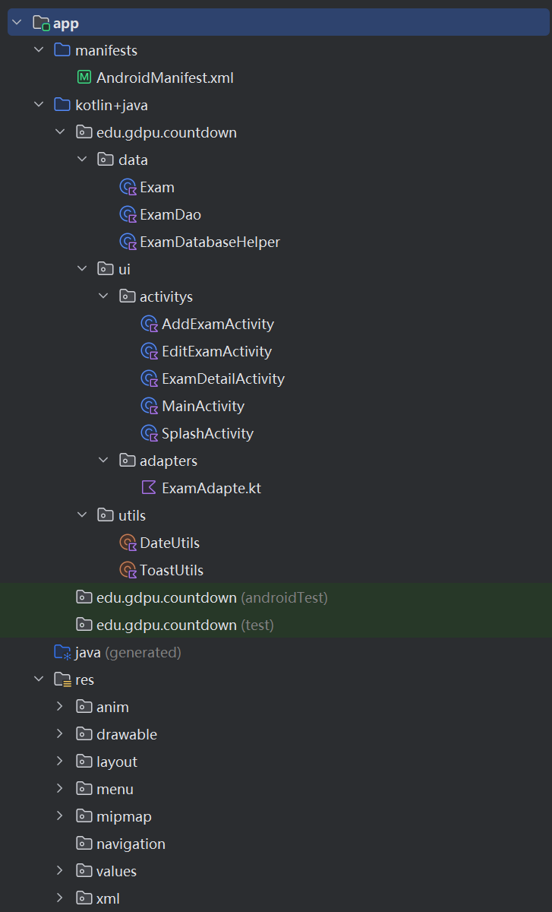

### 2.2 数据库设计
本系统使用 SQLite 作为数据库，主要用于存储考试信息。数据库设计如下：

#### 数据库名称
- **exams.db**

#### 数据表
- **表名**：`exams`

#### 表结构
| 字段名           | 数据类型   | 约束条件              | 描述                 |
|------------------|------------|-----------------------|----------------------|
| `id`             | INTEGER    | PRIMARY KEY AUTOINCREMENT | 考试记录的唯一标识符 |
| `name`           | TEXT       | NOT NULL             | 考试名称             |
| `target_date`    | INTEGER    | NOT NULL             | 考试目标日期（时间戳）|
| `is_pinned`      | INTEGER    | DEFAULT 0            | 是否置顶（0：否，1：是）|

#### 数据表创建语句
```sql
CREATE TABLE exams (
    id INTEGER PRIMARY KEY AUTOINCREMENT,
    name TEXT NOT NULL,
    target_date INTEGER NOT NULL,
    is_pinned INTEGER DEFAULT 0
);
```

#### 数据库功能
1. **插入数据**：通过 `insertExam` 方法将考试信息插入数据库。
2. **更新数据**：通过 `updateExam` 方法更新已有考试记录。
3. **删除数据**：通过 `deleteExam` 方法删除指定考试记录。
4. **查询单条数据**：通过 `getExamById` 方法根据 ID 查询单个考试信息。
5. **查询所有数据**：通过 `getAllExams` 方法获取所有考试记录，并按置顶状态和目标日期排序。

#### 数据库升级策略
- 当数据库版本更新时，删除旧表并重新创建新表：
```sql
DROP TABLE IF EXISTS exams;
```
然后重新执行创建表的 SQL 语句。

### 2.3 界面设计

#### 1. 启动界面（SplashActivity）
- **功能**：展示启动动画，提升用户体验。
- **设计**：包含应用 Logo，动画结束后自动跳转到主界面。
- **界面示例**：  
  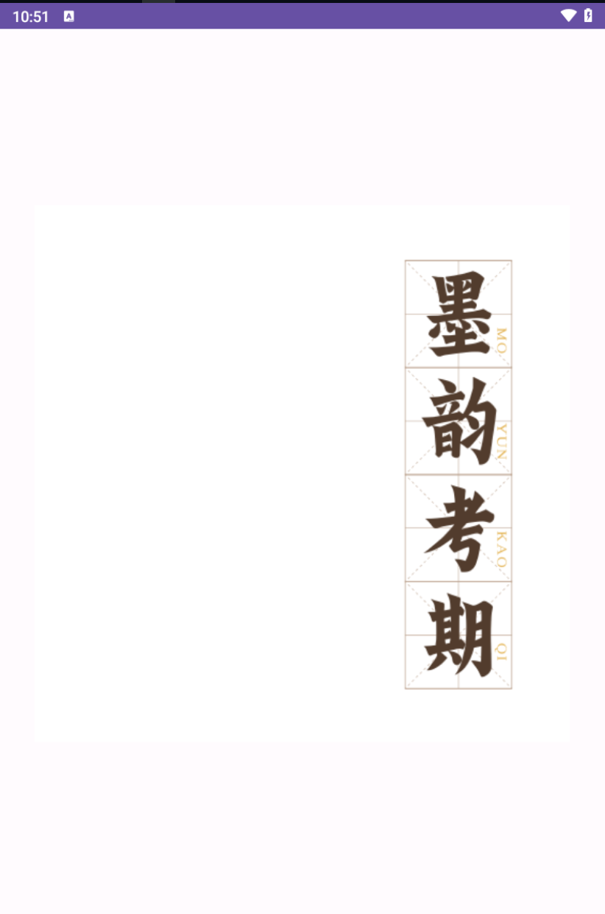

#### 2. 主界面（MainActivity）
- **功能**：展示考试倒计时列表
- **设计**：
  - 顶部：应用标题、菜单按钮、添加按钮。
  - 中部：RecyclerView 列表，按置顶状态和目标日期排序显示考试信息。
- **界面示例**：  
  - 主界面：  
    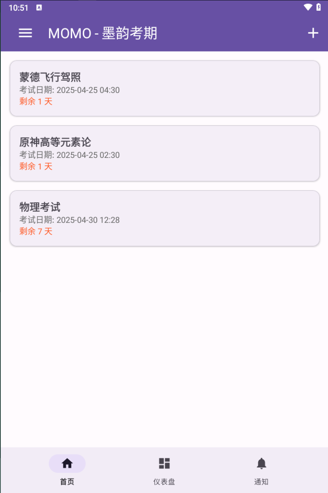
  - 主界面侧边栏：  
    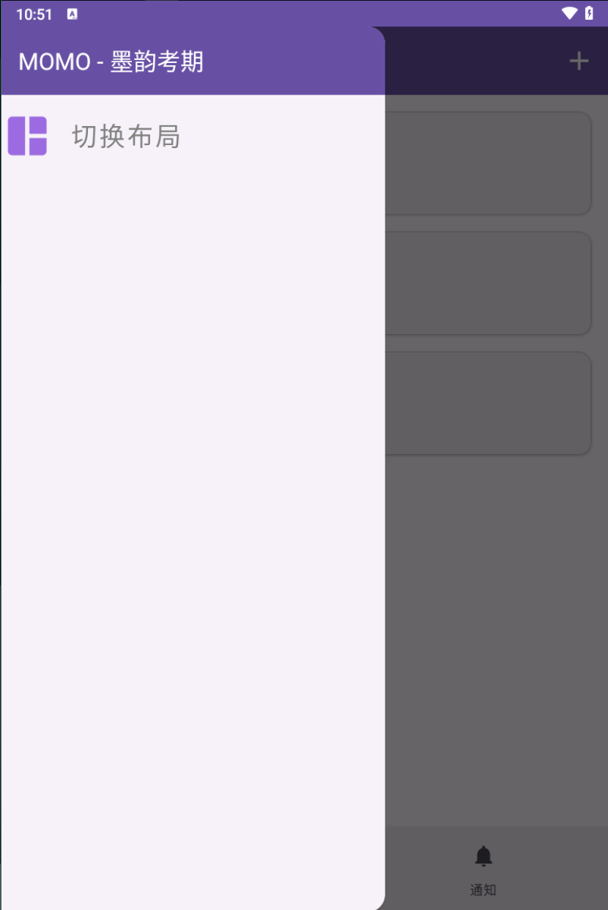

#### 3. 添加考试界面（AddExamActivity）
- **功能**：允许用户输入考试名称和目标日期，并保存到数据库。
- **设计**：
  - 输入框：考试名称和日期时间选择器。
  - 按钮：保存操作，返回操作。
- **界面示例**：  
  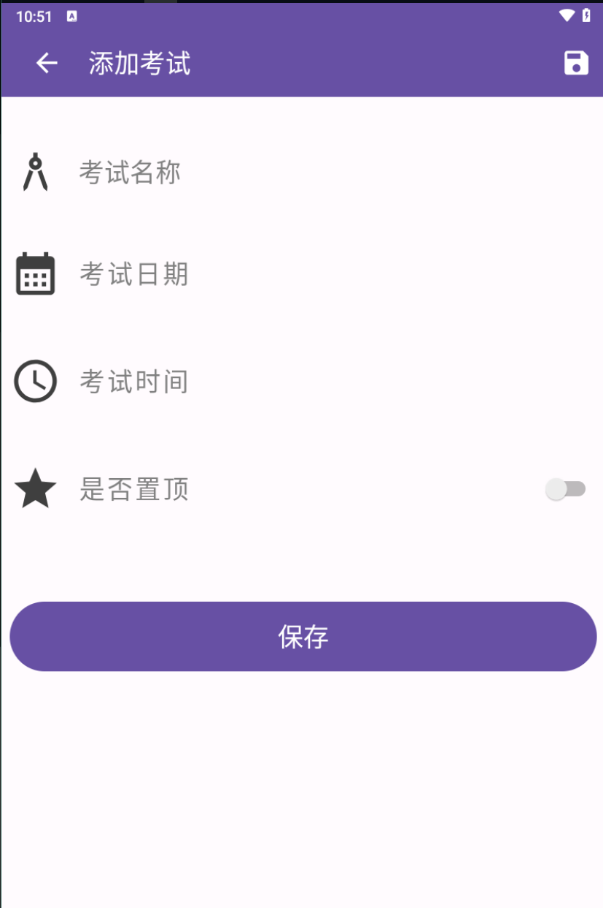

#### 4. 考试详情界面（ExamDetailActivity）
- **功能**：展示单个考试的详细信息，包括名称、目标日期和倒计时
- **设计**：
  - 信息展示区域：考试名称和目标日期。
  - 操作按钮：编辑和删除考试。
- **界面示例**：  
  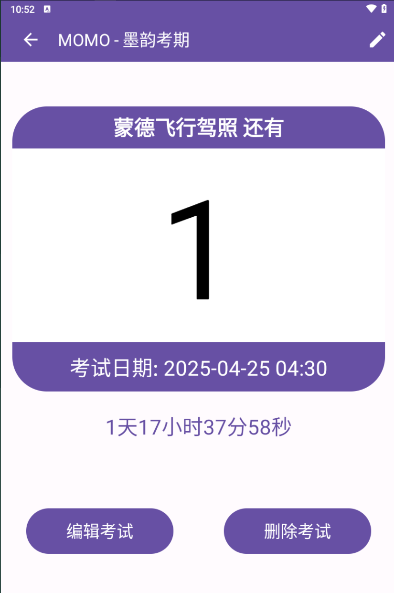

#### 5. 编辑考试界面（EditExamActivity）
- **功能**：允许用户修改考试信息并保存更改。
- **设计**：
  - 输入框：考试名称和日期选择器，预填充当前信息。
  - 按钮：保存和返回操作。
- **界面示例**：  
  

## 3. 实现过程
### 3.1 核心功能实现
- 功能1：启动界面（SplashActivity）通过 `Handler` 延迟 3 秒后跳转到主界面。
```Kotlin
fun loading(sleepTime: Long) {
    Handler(Looper.getMainLooper()).postDelayed({
        val intent = Intent(this, MainActivity::class.java)
        startActivity(intent)
        finish()
    }, sleepTime)
}
```

- 功能2：主界面（MainActivity）使用 `RecyclerView` 展示考试列表，支持切换布局（线性/网格）。
```Kotlin
private fun changeLayout() {
    val layoutManager = if (isGridLayout) {
        LinearLayoutManager(this)
    } else {
        GridLayoutManager(this, 2)
    }
    recyclerView.layoutManager = layoutManager
    isGridLayout = !isGridLayout
}
```

- 功能3：添加考试（AddExamActivity）：通过日期和时间选择器获取用户输入，并保存到数据库。
```Kotlin
private fun saveExamInfo() {
    if (!validateInput()) return
    val exam = Exam(
        name = editExamName.text.toString().trim(),
        targetDate = calendar.timeInMillis,
        isPinned = swIsPinned.isChecked
    )
    if (examDao.insertExam(exam) != -1L) {
        showToast("考试信息已保存")
        finishWithTransition()
    }
}
```
- 功能4：编辑考试（EditExamActivity）加载考试信息，允许用户修改并保存更新。
```kotlin
private fun saveExamInfo() {
    val updatedExam = originalExam.copy(
        name = editExamName.text.toString().trim(),
        targetDate = calendar.timeInMillis,
        isPinned = swIsPinned.isChecked
    )
    if (examDao.updateExam(updatedExam) > 0) {
        ToastUtils.show(this, "更新成功", Toast.LENGTH_SHORT)
        finishWithAnimation()
    }
}
```
- 功能5：考试详情（ExamDetailActivity）展示考试倒计时，并支持删除和编辑操作。
```kotlin
private fun updateRemainingTimeUI() {
    val remainingTime = exam.targetDate - System.currentTimeMillis()
    if (remainingTime > 0) {
        val days = remainingTime / (1000 * 60 * 60 * 24)
        tvTimeLeft.text = "$days 天剩余"
    } else {
        tvTimeLeft.text = "考试已开始！"
    }
}
```

### 3.2 关键技术
- **RecyclerView**：用于展示考试列表，支持动态更新和布局切换。
- **SQLite**：通过 `ExamDao` 实现数据的增删改查。
- **Handler**：实现启动界面的延迟跳转。
- **DatePickerDialog 和 TimePickerDialog**：实现日期和时间选择功能。
- **CountDownTimer**：实现考试倒计时功能。


## 4. 功能演示
1. 功能1：布局切换  
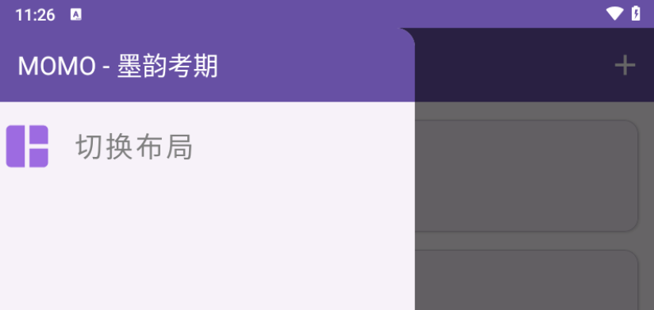
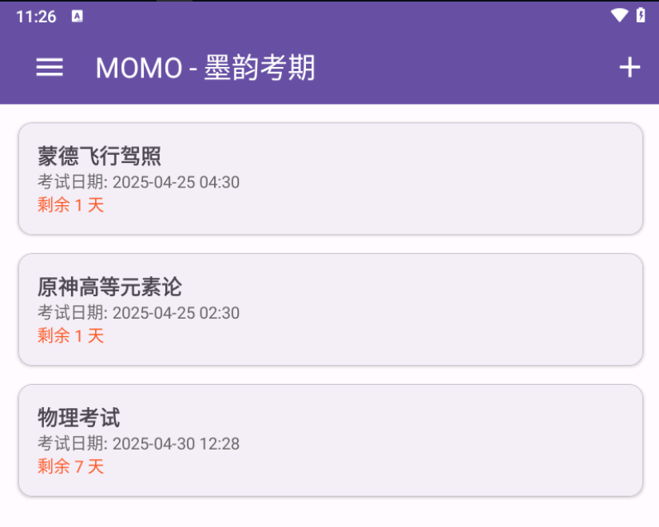
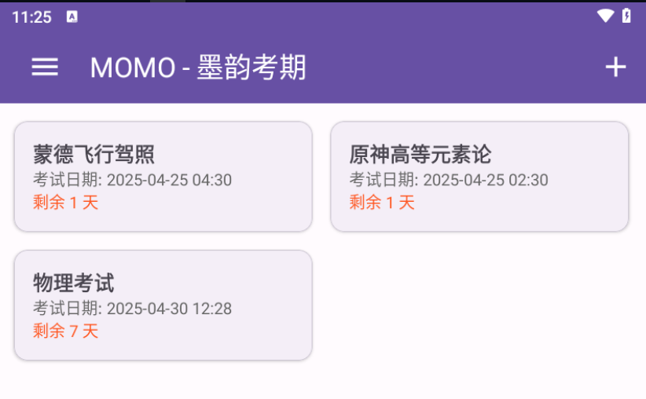

2. 功能2：动态显示倒计时  


3. 功能3：保存考试信息  


3. 功能3：修改考试信息  


4. 功能4：删除考试  
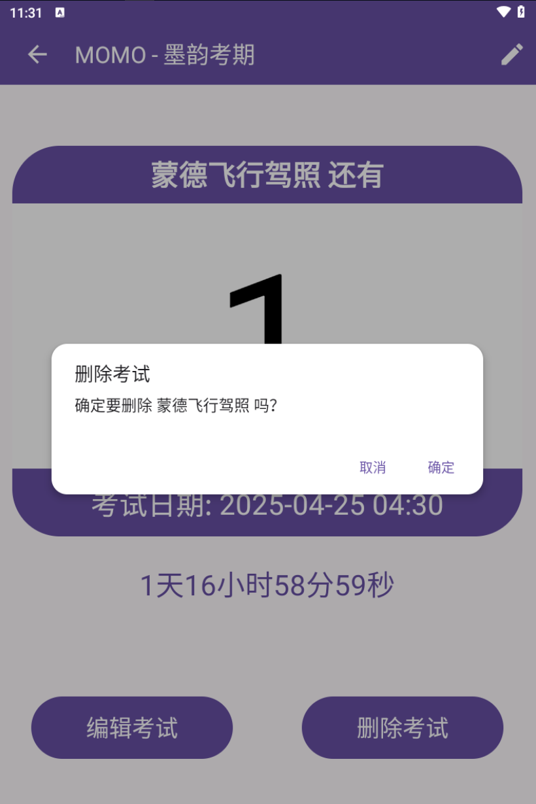

5. 功能4：日期选择  
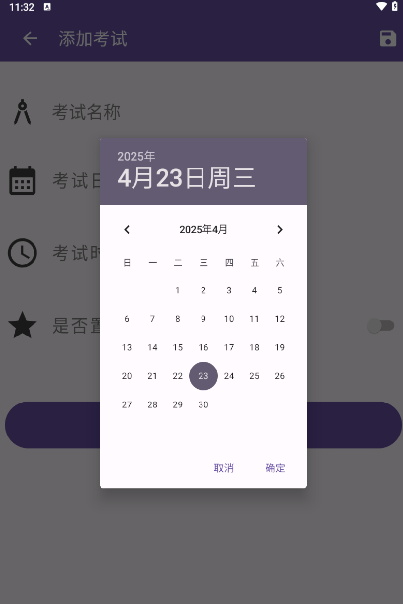

6. 功能4：时间选择  
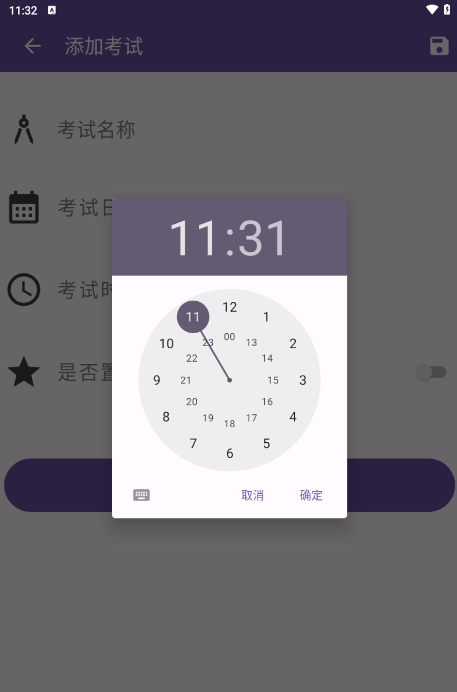

## 参考资料
[1] 郭霖. 第一行代码:Android开发实战经典(第3版)[M]. 北京:人民邮电出版社, 2019.   
[2] Android Developers. Android Developer Documentation[EB/OL]. https://developer.android.com/docs, 2024-03-20.

